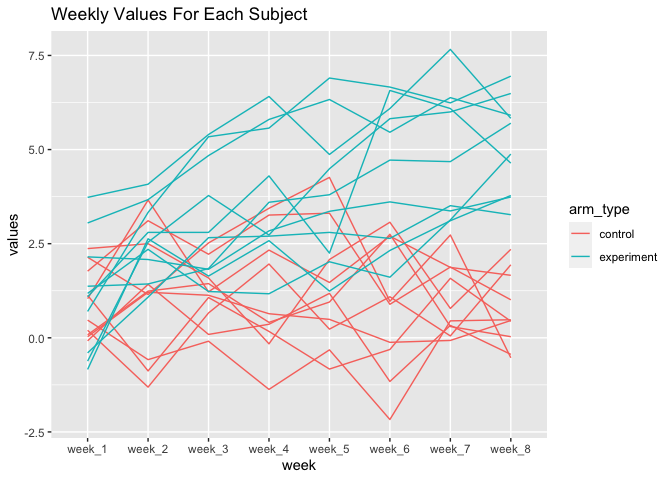

p8105\_HW5
================
Yuchen Zheng
11/16/2021

``` r
library(tidyverse)
library(readr)
```

## Problem 1

Create a city\_state variable and summarize within cities to obtain the
total number of homicides and the number of unsolved homicides.

``` r
homicide_df = 
  read_csv("./data/homicide-data.csv", na = c("", "Unknown")) %>% 
  mutate(city_state = str_c(city, state),
         resolution = case_when(
           disposition == "Closed without arrest" ~ "unsolved",
           disposition == "Open/No arrest"        ~ "unsolved",
           disposition == "Closed by arrest"     ~ "solved"
          )) %>% 
  relocate(city_state) %>% 
  filter(city_state != "TulsaAL")
```

    ## Rows: 52179 Columns: 12

    ## ── Column specification ────────────────────────────────────────────────────────
    ## Delimiter: ","
    ## chr (8): uid, victim_last, victim_first, victim_race, victim_sex, city, stat...
    ## dbl (4): reported_date, victim_age, lat, lon

    ## 
    ## ℹ Use `spec()` to retrieve the full column specification for this data.
    ## ℹ Specify the column types or set `show_col_types = FALSE` to quiet this message.

``` r
baltimore_df = 
  homicide_df %>% 
  filter(city_state == "BaltimoreMD")

baltimore_summary = 
baltimore_df %>% 
  summarize(
    unsolved = sum(resolution == "unsolved"),
    n = n()
  )

baltimore_test = 
  prop.test(
  x = baltimore_summary %>% pull(unsolved),
  n = baltimore_summary %>% pull(n)
)

baltimore_test %>% 
  broom::tidy()
```

    ## # A tibble: 1 × 8
    ##   estimate statistic  p.value parameter conf.low conf.high method    alternative
    ##      <dbl>     <dbl>    <dbl>     <int>    <dbl>     <dbl> <chr>     <chr>      
    ## 1    0.646      239. 6.46e-54         1    0.628     0.663 1-sample… two.sided

``` r
prop_test_function = function(city_df){
  
  city_summary = 
    city_df %>% 
    summarize(
      unsolved = sum(resolution == "unsolved"),
      n = n()
  )

  city_test = 
    prop.test(
      x = city_summary %>% pull(unsolved),
      n = city_summary %>% pull(n)) 
      
  return(city_test)
  
}
```

``` r
results_df = 
  homicide_df %>% 
  nest(data = uid:resolution) %>% 
  mutate(
    test_results = map(data, prop_test_function),
    tidy_results = map(test_results, broom::tidy)
  ) %>% 
  select(city_state, tidy_results) %>% 
  unnest(tidy_results) %>% 
  select(city_state, estimate, starts_with("conf"))
```

``` r
results_df %>% 
  mutate(city_state = fct_reorder(city_state, estimate)) %>% 
  ggplot(aes(x = city_state, y = estimate)) +
  geom_point() +
  geom_errorbar(aes(ymin = conf.low, ymax = conf.high)) + 
  theme(axis.text.x = element_text(angle = 90, vjust = 0.5, hjust = 1))
```

<!-- -->

## Problem 2

``` r
files = tibble(
  file_names = list.files("./data/zip_data/")
)
```

``` r
read_csv_function = function(file_names){
  
  data = read_csv(str_c("./data/zip_data/",file_names))  
  
  return(data)
}
```

``` r
files_df =
  files %>% 
  mutate(
    data = map(file_names, read_csv_function)
  ) %>% 
  unnest(data) %>% 
  mutate(file_names = substr(file_names, 1, 6),
         arm_type = factor(rep(c("control", "experiment"), each = 10))) %>% 
  rename(subject_id = file_names) %>% 
  relocate(subject_id, arm_type)
  

files_df %>% 
  pivot_longer(week_1:week_8, 
               names_to = "week", 
               values_to = "values") %>% 
  ggplot(aes(x = week, y = values, group = subject_id, color = arm_type)) + 
  geom_path() +
  labs(title = "Weekly Values For Each Subject") 
```

<!-- -->

Subjects in the experimental group started with similar values as the
subjects in the control group. Values for subjects in the experimental
group were increasing over the course of the study and were mostly
greater than values for those in the control group. At the end, all
subjects in the experimental group had values greater than the values
for all subjects in the control group.

## Problem 3

``` r
set.seed(10)

iris_with_missing = iris %>% 
  map_df(~replace(.x, sample(1:150, 20), NA)) %>%
  mutate(Species = as.character(Species))
```

``` r
fill_in_missing = function(column) {
  
  if (is.numeric(column)) {
    column = replace_na(column, round(mean(column, na.rm = TRUE), digits = 1))
  }
  
  else if (is.character(column)) {
    column = replace_na(column, "virginica")
  }
  return(column)
}
```

``` r
iris_no_missing =
  iris_with_missing %>% 
  map_df(~fill_in_missing(.x))
```
